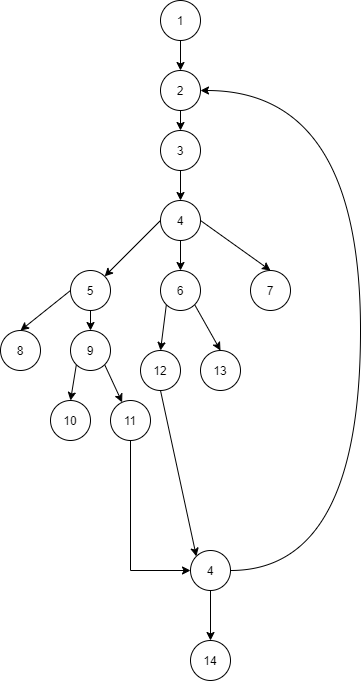
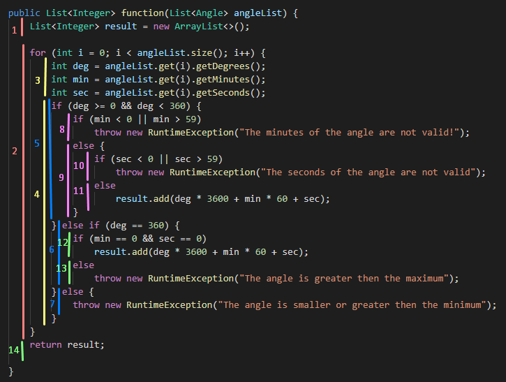

# Втора лабораториска вежба по Софтверско инженерство

## Елена Стамкова, бр. на индекс 136002

### Група на код: 

Ја добив групата на код 6

###  Control Flow Graph

### Цикломатска комплексност

CYC = E – N + 2P
CYC = 16 - 14 + 2*4 = 10
Цикломатската комплексност на овој код е 10 и истата ја добив преку горенаведената формула за пресметување.
Буквата Е означува број на рабовите кои ги поврзуваат јазлите или таканаречени трансфери на контрола, ги имаме 16.
Буквата N означува број на јазли во графот или секвенцијална група на изјави кои содржат само еден трансфер на контрола, и во нашиот случај изнесуваат 14.
Буквата P означува број делови од графот кои се исклучуваат или со други зборови каде што програмата ни паѓа или завршува.
Такви ги имаме 4 во нашиот случај. 
Со тоа, ние сме ја пресметале цикломатската комплексност на нашиот код.

### Тест случаи според критериумот  Every branch 

    @Test
    public void test1() {
        //Testing branch 1,2,3,4,5,8
        Angle angle = new Angle(30,60,90);
        List<Angle> anglesList = new ArrayList<>();
        anglesList.add(angle);
        try {
            SILab2.function(anglesList);
        } catch (Exception e){
            assertEquals(e.getMessage(),"The minutes of the angle are not valid!");
        }
    }

    @Test
    public void test2() {
        //Testing branch 1,2,3,4,5,9,10
        Angle angle = new Angle(30,40,90);
        List<Angle> anglesList = new ArrayList<>();
        anglesList.add(angle);
        try {
            SILab2.function(anglesList);
        } catch (Exception e){
            assertEquals(e.getMessage(),"The seconds of the angle are not valid");
        }
    }

    @Test
    public void test3() {
        //Testing branch 1,2,3,4,5,9,11,4,14
        Angle angle = new Angle(30,40,45);
        List<Angle> anglesList = new ArrayList<>();
        List<Integer> result = new ArrayList<>();
        anglesList.add(angle);
        result = SILab2.function(anglesList);
        assertEquals(result.get(0).intValue(),angle.getDegrees()*3600 + angle.getMinutes()*60 + angle.getSeconds());
    }

    @Test
    public void test4() {
        //Testing branch 1,2,3,4,6,12,4,14
        Angle angle = new Angle(360,0,0);
        List<Angle> anglesList = new ArrayList<>();
        List<Integer> result = new ArrayList<>();
        anglesList.add(angle);
        result = SILab2.function(anglesList);
        assertEquals(result.get(0).intValue(),angle.getDegrees()*3600 + angle.getMinutes()*60 + angle.getSeconds());
    }

    @Test
    public void test5() {
        //Testing branch 1,2,3,4,6,13
        Angle angle = new Angle(360,40,90);
        List<Angle> anglesList = new ArrayList<>();
        anglesList.add(angle);
        try {
            SILab2.function(anglesList);
        } catch (Exception e){
            assertEquals(e.getMessage(),"The angle is greater then the maximum");
        }
    }

    @Test
    public void test6() {
        //Testing branch 1,2,3,4,7
        Angle angle = new Angle(30,40,58);
        Angle angle1 = new Angle(400,25,30);
        List<Angle> anglesList = new ArrayList<>();
        anglesList.add(angle);
        anglesList.add(angle1);
        try {
            SILab2.function(anglesList);
        } catch (Exception e){
            assertEquals(e.getMessage(),"The angle is smaller or greater then the minimum");
        }
    }

### Тест случаи според критериумот Every path

    @Test
    public void test7() {
        //PATH Test
        //Testing path 1,2,3,4,6,12,4,2,3,4,6,13
        Angle angle = new Angle(360,0,0);
        Angle angle1 = new Angle(360,25,30);
        List<Angle> anglesList = new ArrayList<>();
        anglesList.add(angle);
        anglesList.add(angle1);
        try {
            SILab2.function(anglesList);
        } catch (Exception e){
            assertEquals(e.getMessage(),"The angle is greater then the maximum");
        }
    }

    @Test
    public void test8() {
        //PATH Test
        //Testing path 1,2,3,4,5,9,11,4,2,3,4,6,12,4,2,3,4,7
        Angle angle = new Angle(270,20,3);
        Angle angle1 = new Angle(360,0,0);
        Angle angle2 = new Angle(400,80,100);
        List<Angle> anglesList = new ArrayList<>();
        List<Integer> result = new ArrayList<>();
        anglesList.add(angle);
        anglesList.add(angle1);
        anglesList.add(angle2);

        try {
            result = SILab2.function(anglesList);
        } catch (Exception e){
            assertEquals(e.getMessage(),"The angle is smaller or greater then the minimum");
        }
    }

    @Test
    public void test9() {
        //PATH Test
        //Testing path 1,2,3,4,5,9,11,4,2,3,4,6,12,4,14
        Angle angle = new Angle(270,20,3);
        Angle angle1 = new Angle(360,0,0);
        List<Angle> anglesList = new ArrayList<>();
        List<Integer> result = new ArrayList<>();
        anglesList.add(angle);
        anglesList.add(angle1);
        result = SILab2.function(anglesList);
        assertEquals(result.get(0).intValue(),angle.getDegrees()*3600 + angle.getMinutes()*60 + angle.getSeconds());
        assertEquals(result.get(1).intValue(),angle1.getDegrees()*3600 + angle1.getMinutes()*60 + angle1.getSeconds());
    }

### Објаснување на напишаните unit tests

#####Тестови според критериумот Every branch

#####Тест 1:

Во првиот тест случај, го тестираме бренчот кој се движи од 1,2,3,4,5,8.
Во овој случај проверуваме дали степените ни се помеѓу 0 и 360 и ако тој услов е исполнет, проверуваме дали минутите ни се помали од 0 или поголеми од 59. 
Ако тој услов е исполнет, кодот ни фрла исклучок што значи нашиот тест ќе помине. Затоа во мојот тест случај, за минути имаме вредност 60, што е вредност очекувана за кодот да "падне".

#####Тест 2:

Во вториот тест случај, го тестираме бренчот кој се движи низ јазлите 1,2,3,4,5,9,10.
Тука ги тестираме секундите дали ни се во ред, затоа за нив имаме зададено вредност 90 која всушност е погрешна. Затоа добиваме исклучок и програмата овде ни завршува, а тестот овде ни поминува успешно.

#####Тест 3:

Во третиот тест, поминуваме низ јазлите 1,2,3,4,5,9,11,4,14.
Овде немаме никаков исклучок, ако и степените и минутите и секундите се со соодветни вредности, реални, тогаш се пресметува формула која ги враќа аглите претворени во секунди.

#####Тест 4:

Во четвртиот тест поминуваме низ јазлите 1,2,3,4,6,12,4,14.
Овде го испитуваме случајот ако степените се точно 360, а минутите и секундите еднакви на 0, тогаш повторно се пресметува соодветната формула за претворање во секунди.

#####Тест 5:

Претпоследниот бренч ни се движи од 1,2,3,4,6,13.
Во овој случај имаме коректен број на степени, но испитуваме што ќе се случи ако минутите и секундите имаат различна вредност од 0. 
Тогаш, тоа означува дека имаме поголем агол од максималниот, и програмата ни фрла исклучок. 

#####Тест 6:

И во последниот тест случај од критериумот Every Branch, поминуваме низ 1,2,3,4,7.
Овде имаме два објекти од Angle, каде што првиот е со коректни вредности, а вториот е со погрешни.
Во овој случај, првиот објект ќе помине, но на вториот пак ќе имаме фрлање на исклучок бидејќи вредностите не одговараат со нашите услови зададени во кодот.

Сите тест случаи од Every Branch критериумот поминуваат успешно.

#####Тестови според критериумот Every path

#####Тест 7:

Тест случаите за патеките се повеќе сложени од претходните бидејќи овде не завршуваме откако ќе поминеме само еден даден услов, туку може и да се враќаме и да одбереме различна патека.
Постојат поголем број на патеки кои можат да се одберат низ дадениот граф. 
Ние ќе поминеме само дел, бидејќи и гореспомнатите тестови се исто така патеки.

Во првиот случај одбравме патека која се движи низ јазлите 1,2,3,4,6,12,4,2,3,4,6,13.
Овде исто така имаме 2 објекта од кои првиот е со соодветни вредности, а вториот е со погрешни.
Овде исто така имаме и повторно изминување на for циклусот во кодот. Првиот објект поминува, но на вториот програмата ни фрла исклучок.
Со тоа нашиот тест е успешен.

#####Тест 8:

Патека за тестирање: 1,2,3,4,5,9,11,4,2,3,4,6,12,4,2,3,4,7.
Овде имаме вкупно 3 изминувања од for циклусот. Затоа имаме и 3 објекта. Првите два се со коректни вредности, но на третиот програмата фрла исклучок.

#####Тест 9:

Патека: 1,2,3,4,5,9,11,4,2,3,4,6,12,4,14.
Овде имаме малку поразличен тест, каде што имаме 2 изминувања и 2 објекта.
Бидејќи и во двата вредностите се соодветни, програмата не фрла исклучок, туку си прави пресметување и ги претвора аглите во секунди.

Со тоа имаме вкупно 3 успешни теста. 
Како што и погоре спомнав, може да имаме повеќе патеки, а со тоа и повеќе тест случаи, кои се пишуваат на ист начин како и овие што ги опишав.

